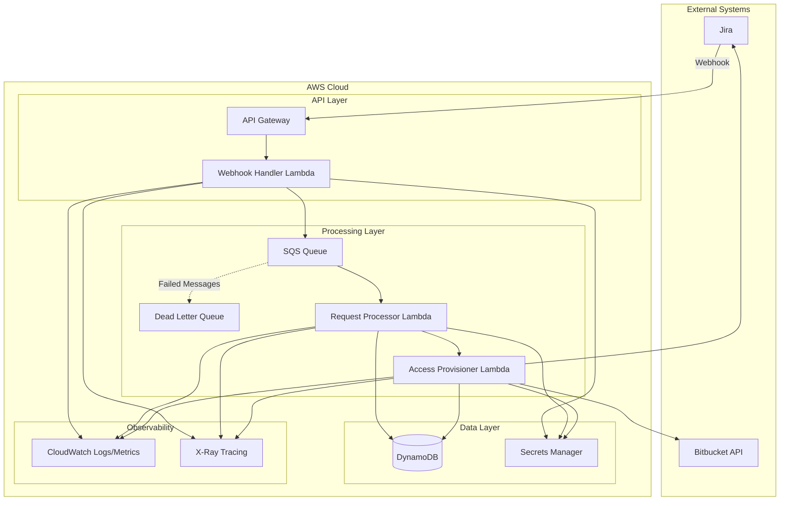

# Design Document: Jira-Bitbucket Access Agent

## Overview

The Jira-Bitbucket Access Agent is a cloud-native, event-driven system built on AWS Bedrock Agent Core using the Strands framework. The agent automates the process of granting Bitbucket repository access based on Jira ticket requests. The system follows AWS Well-Architected Framework principles, emphasizing security, reliability, performance efficiency, cost optimization, and operational excellence.

The architecture leverages serverless AWS services including Lambda, API Gateway, SQS, DynamoDB, CloudWatch, and Secrets Manager to create a scalable, maintainable, and production-ready solution.

## Architecture

### High-Level Architecture



### Event Flow

1. **Webhook Reception**: Jira sends webhook to API Gateway when access request ticket is created
2. **Validation**: Webhook Handler Lambda validates signature and extracts ticket data
3. **Queueing**: Validated request is placed in SQS queue for asynchronous processing
4. **Request Processing**: Request Processor Lambda parses ticket, validates fields, and checks security policies
5. **Access Provisioning**: Access Provisioner Lambda grants Bitbucket permissions and updates Jira ticket
6. **Audit Logging**: All operations are logged to DynamoDB and CloudWatch

### Technology Stack

- **Agent Framework**: AWS Bedrock Agent Core with Strands
- **Compute**: AWS Lambda (Python 3.11 or Node.js 18)
- **API Gateway**: AWS API Gateway (REST API)
- **Message Queue**: AWS SQS with Dead Letter Queue
- **Database**: AWS DynamoDB for audit logs and state management
- **Secrets**: AWS Secrets Manager for API credentials
- **Observability**: CloudWatch Logs, CloudWatch Metrics, AWS X-Ray
- **IaC**: AWS CDK (TypeScript) or Terraform
- **CI/CD**: AWS CodePipeline or GitHub Actions

## Components and Interfaces

### 1. Webhook Handler Lambda

**Purpose**: Receives and validates Jira webhooks, extracts ticket information, and queues requests.

**Inputs**:
- Jira webhook payload (JSON)
- Webhook signature header

**Outputs**:
- SQS message containing parsed ticket data
- HTTP 200/400/401 response to Jira

**Key Functions**:
- `validate_webhook_signature(payload, signature, secret)`: Verifies webhook authenticity
- `extract_ticket_data(webhook_payload)`: Parses Jira ticket information
- `queue_request(ticket_data)`: Sends message to SQS queue

**Error Handling**:
- Invalid signature: Return 401, log security event
- Malformed payload: Return 400, log error
- SQS unavailable: Return 500, rely on Jira retry

### 2. Request Processor Lambda

**Purpose**: Processes queued requests, validates access requests, and performs security checks.

**Inputs**:
- SQS message with ticket data

**Outputs**:
- Validated access request passed to Access Provisioner
- Updated Jira ticket (if validation fails)
- Audit log entry in DynamoDB

**Key Functions**:
- `parse_access_request(ticket_description)`: Extracts username, repository, permission level
- `validate_required_fields(request)`: Ensures all required fields are present
- `check_user_exists_in_bitbucket(username)`: Verifies user in Bitbucket
- `check_repository_exists(repository)`: Verifies repository exists
- `validate_permission_level(permission)`: Ensures permission is valid
- `update_jira_ticket(ticket_id, comment, status)`: Updates Jira ticket

**Error Handling**:
- Missing fields: Comment on Jira ticket with required format
- User not in Bitbucket: Comment on Jira ticket, mark as invalid
- Repository not found: Comment on Jira ticket, mark as invalid
- API errors: Retry with exponential backoff, send to DLQ if max retries exceeded

### 3. Access Provisioner Lambda

**Purpose**: Grants Bitbucket repository access and updates Jira ticket with results.

**Inputs**:
- Validated access request

**Outputs**:
- Bitbucket API call to grant permissions
- Updated Jira ticket with success/failure details
- Audit log entry in DynamoDB

**Key Functions**:
- `authenticate_bitbucket(credentials)`: Authenticates with Bitbucket API
- `grant_repository_access(username, repository, permission)`: Grants access via API
- `update_jira_ticket_success(ticket_id, details)`: Updates ticket with success message
- `update_jira_ticket_failure(ticket_id, error)`: Updates ticket with failure details
- `create_audit_log(request, result)`: Records audit trail

**Error Handling**:
- Authentication failure: Log error, update Jira ticket, send to DLQ
- Permission grant failure: Log error, update Jira ticket with Bitbucket error
- Jira update failure: Log error, ensure audit log is still created

### 4. Secrets Manager Integration

**Purpose**: Securely stores and retrieves API credentials.

**Secrets Stored**:
- Jira API token
- Jira webhook secret
- Bitbucket API token
- Bitbucket workspace/organization ID

**Access Pattern**:
- Lambdas retrieve secrets on cold start
- Secrets cached for Lambda execution lifetime
- Automatic rotation supported

### 5. DynamoDB Audit Table

**Purpose**: Stores immutable audit logs of all access provisioning activities.

**Schema**:
```
{
  "requestId": "string (partition key)",
  "timestamp": "number (sort key)",
  "jiraTicketId": "string",
  "requester": "string",
  "targetUser": "string",
  "repository": "string",
  "permissionLevel": "string",
  "status": "string (pending|success|failed)",
  "errorMessage": "string (optional)",
  "bitbucketResponse": "object (optional)",
  "correlationId": "string"
}
```

**Indexes**:
- GSI on `jiraTicketId` for ticket-based queries
- GSI on `targetUser` for user-based queries
- GSI on `repository` for repository-based queries

### 6. SQS Queue Configuration

**Main Queue**:
- Visibility timeout: 5 minutes
- Message retention: 14 days
- Delivery delay: 0 seconds
- Maximum receives: 3

**Dead Letter Queue**:
- Message retention: 14 days
- Alarm on message count > 0

## Data Models

### Access Request

```typescript
interface AccessRequest {
  requestId: string;
  jiraTicketId: string;
  jiraTicketKey: string;
  requester: string;
  targetUser: string;
  repository: string;
  permissionLevel: 'read' | 'write' | 'admin';
  requestedAt: Date;
  status: 'pending' | 'validating' | 'provisioning' | 'success' | 'failed';
  validationErrors?: string[];
  correlationId: string;
}
```

### Jira Webhook Payload

```typescript
interface JiraWebhookPayload {
  webhookEvent: string;
  issue: {
    id: string;
    key: string;
    fields: {
      summary: string;
      description: string;
      reporter: {
        displayName: string;
        emailAddress: string;
      };
      status: {
        name: string;
      };
    };
  };
}
```

### Bitbucket Permission Request

```typescript
interface BitbucketPermissionRequest {
  workspace: string;
  repository: string;
  username: string;
  permission: 'read' | 'write' | 'admin';
}
```

### Audit Log Entry

```typescript
interface AuditLogEntry {
  requestId: string;
  timestamp: number;
  jiraTicketId: string;
  requester: string;
  targetUser: string;
  repository: string;
  permissionLevel: string;
  status: 'success' | 'failed';
  errorMessage?: string;
  bitbucketResponse?: object;
  correlationId: string;
  processingDurationMs: number;
}
```

## Correctness Properties

*A property is a characteristic or behavior that should hold true across all valid executions of a system—essentially, a formal statement about what the system should do. Properties serve as the bridge between human-readable specifications and machine-verifiable correctness guarantees.*

### Property 1: Request parsing and storage round-trip

*For any* valid Jira ticket containing access request details, parsing the ticket, storing the request, and retrieving it should produce an access request with the same username, repository, and permission level.

**Validates: Requirements 1.1, 1.2, 1.3**

### Property 2: Validation error specificity

*For any* access request with missing or invalid fields, the validation error message should explicitly mention which specific field is problematic (username, repository, or permission level).

**Validates: Requirements 1.2, 1.4**

### Property 3: Ticket status transitions are monotonic

*For any* Jira ticket processed by the agent, the status should progress through states (pending → processing → resolved) without moving backwards, and processing should always update the status to indicate processing has begun.

**Validates: Requirements 1.5, 2.5**

### Property 4: Permission grant precision

*For any* validated access request with successful authentication, the permission level granted in Bitbucket should exactly match the requested permission level (no more, no less).

**Validates: Requirements 2.2**

### Property 5: Success updates contain required information

*For any* successful access provisioning operation, the Jira ticket update should contain both a timestamp and the granted permission details.

**Validates: Requirements 2.3**

### Property 6: Error propagation completeness

*For any* Bitbucket API error during provisioning, both a log entry and a Jira ticket update should be created, and the Jira update should contain information from the Bitbucket error.

**Validates: Requirements 2.4**

### Property 7: User existence validation with specific feedback

*For any* access request where the target user does not exist in Bitbucket, the agent should update the Jira ticket with a message specifically stating the user is not available in Bitbucket.

**Validates: Requirements 3.1, 3.2**

### Property 8: Repository existence validation with specific feedback

*For any* access request where the repository does not exist, the agent should update the Jira ticket with a message specifically stating the project is not available.

**Validates: Requirements 3.3, 3.4**

### Property 9: Permission level whitelist enforcement

*For any* access request, only permission levels in the allowed set ('read', 'write', 'admin') should pass validation; all other values should be rejected.

**Validates: Requirements 3.5**

### Property 10: Security policy violation reporting

*For any* access request that violates a security policy, the rejection message should include the specific policy that was violated.

**Validates: Requirements 3.6**

### Property 11: Validation gates provisioning

*For any* access request, provisioning should only be attempted if all security validations (user exists, repository exists, permission valid) pass.

**Validates: Requirements 3.7**

### Property 12: Structured logging consistency

*For any* request processed by the agent, at least one structured log entry should be emitted to CloudWatch with required fields (requestId, timestamp, operation, status).

**Validates: Requirements 5.1**

### Property 13: Metrics emission completeness

*For any* completed request (success or failure), metrics should be published including request count and processing duration.

**Validates: Requirements 5.2, 5.5**

### Property 14: Trace creation for operations

*For any* agent operation, a distributed trace segment should be created in X-Ray with the operation name and correlation ID.

**Validates: Requirements 5.3**

### Property 15: Error logs contain debugging context

*For any* error that occurs, the log entry should contain at minimum the request ID, operation name, and error message.

**Validates: Requirements 5.4**

### Property 16: Retry with exponential backoff

*For any* transient API error, retry attempts should occur with increasing delays (each delay should be longer than the previous).

**Validates: Requirements 6.1**

### Property 17: Dead letter queue on max retries

*For any* request that exceeds maximum retry attempts, the request should be moved to the dead letter queue.

**Validates: Requirements 6.2**

### Property 18: Message acknowledgment after success

*For any* SQS message, acknowledgment should only occur after successful processing; failed processing should leave the message in the queue.

**Validates: Requirements 6.3, 6.4**

### Property 19: Restart idempotency

*For any* set of pending requests, processing them before and after an agent restart should produce the same final state (same access grants, same Jira updates).

**Validates: Requirements 6.5**

### Property 20: Credentials from Secrets Manager

*For any* API operation requiring credentials, the credentials should be retrieved from AWS Secrets Manager, not from environment variables or hardcoded values.

**Validates: Requirements 7.1**

### Property 21: TLS for external connections

*For any* HTTP client used to communicate with external APIs (Jira, Bitbucket), the client should be configured to use HTTPS (TLS encryption).

**Validates: Requirements 7.4**

### Property 22: Log sanitization

*For any* log entry, the log message should not contain patterns matching API tokens, passwords, or other credentials (e.g., strings starting with "Bearer ", "token:", or matching common secret patterns).

**Validates: Requirements 7.5**

### Property 23: Webhook signature validation

*For any* incoming webhook, signature validation should occur, and webhooks with invalid signatures should be rejected with a 401 response and security log entry.

**Validates: Requirements 8.2, 8.4**

### Property 24: Valid webhook processing

*For any* webhook with a valid signature, the agent should extract ticket information and create a processing request.

**Validates: Requirements 8.3**

### Property 25: Audit log completeness

*For any* access provisioning operation, an audit log entry should be created containing all required fields: timestamp, requester, target user, repository, permission level, status, and correlation ID.

**Validates: Requirements 9.1, 9.3**

### Property 26: Audit-first persistence

*For any* completed operation, the audit log should be persisted to DynamoDB before the SQS message is acknowledged.

**Validates: Requirements 9.4**

### Property 27: Audit log query correctness

*For any* set of audit logs, querying by user, repository, or date range should return exactly the logs matching those criteria and no others.

**Validates: Requirements 9.5**

## Error Handling

### Error Categories

1. **Validation Errors** (4xx equivalent)
   - Missing required fields
   - Invalid permission levels
   - User not found in Bitbucket
   - Repository not found
   - Action: Update Jira ticket with specific error, mark as resolved with failure

2. **Authentication Errors** (401)
   - Invalid Bitbucket credentials
   - Invalid Jira credentials
   - Invalid webhook signature
   - Action: Log security event, send to DLQ for manual review

3. **Transient Errors** (5xx, network timeouts)
   - Bitbucket API temporarily unavailable
   - Jira API temporarily unavailable
   - DynamoDB throttling
   - Action: Retry with exponential backoff (3 attempts), then DLQ

4. **System Errors**
   - Lambda timeout
   - Out of memory
   - Unhandled exceptions
   - Action: Log error with full context, send to DLQ, trigger alarm

### Retry Strategy

```typescript
interface RetryConfig {
  maxAttempts: 3;
  baseDelayMs: 1000;
  maxDelayMs: 30000;
  backoffMultiplier: 2;
  jitter: true;
}
```

**Retry Logic**:
- Attempt 1: Immediate
- Attempt 2: 1s + jitter
- Attempt 3: 2s + jitter
- After 3 attempts: Send to DLQ

**Retryable Errors**:
- HTTP 429 (Rate Limit)
- HTTP 500, 502, 503, 504
- Network timeouts
- Connection errors

**Non-Retryable Errors**:
- HTTP 400, 401, 403, 404
- Validation errors
- Authentication failures

### Dead Letter Queue Handling

- DLQ messages trigger CloudWatch alarm
- Manual review process for DLQ messages
- Separate Lambda for DLQ processing and analysis
- DLQ messages retained for 14 days

## Testing Strategy

### Unit Testing

The system will use **Jest** (for Node.js/TypeScript) or **pytest** (for Python) for unit testing.

**Unit Test Coverage**:
- Webhook signature validation with valid/invalid signatures
- Access request parsing with various ticket formats
- Field validation with missing/invalid fields
- Error message formatting
- Retry logic with different error types
- Audit log entry creation
- Secrets Manager integration (mocked)

**Example Unit Tests**:
- Test webhook handler rejects invalid signatures
- Test parser extracts all fields from well-formed ticket
- Test parser handles missing fields gracefully
- Test permission validator rejects invalid permission levels
- Test retry logic calculates correct backoff delays
- Test audit log includes all required fields

### Property-Based Testing

The system will use **fast-check** (for TypeScript/JavaScript) or **Hypothesis** (for Python) for property-based testing.

**Property Test Configuration**:
- Minimum 100 iterations per property test
- Each property test tagged with format: `**Feature: jira-bitbucket-access-agent, Property {number}: {property_text}**`
- Each correctness property implemented by a single property-based test

**Property Test Coverage**:
- Request parsing and storage round-trip (Property 1)
- Validation error specificity (Property 2)
- Permission grant precision (Property 4)
- Error propagation completeness (Property 6)
- User/repository validation feedback (Properties 7, 8)
- Permission whitelist enforcement (Property 9)
- Structured logging consistency (Property 12)
- Metrics emission completeness (Property 13)
- Message acknowledgment guarantees (Property 18)
- Audit log completeness (Property 25)
- Audit log query correctness (Property 27)

**Generators**:
- Random Jira webhook payloads with valid structure
- Random access requests with various field combinations
- Random permission levels (valid and invalid)
- Random error responses from APIs
- Random audit log entries

### Integration Testing

**Integration Test Scenarios**:
- End-to-end flow: Webhook → Queue → Processing → Bitbucket → Jira update
- DynamoDB audit log persistence and retrieval
- Secrets Manager credential retrieval
- SQS message processing with visibility timeout
- Dead letter queue message routing
- CloudWatch Logs and Metrics emission

**Test Environment**:
- LocalStack for AWS service mocking
- Mock Jira and Bitbucket APIs
- Docker Compose for local integration testing

### Load Testing

**Load Test Scenarios**:
- Sustained load: 100 requests/minute for 10 minutes
- Burst load: 1000 requests in 1 minute
- Measure: Lambda cold start times, processing duration, error rates
- Verify: Auto-scaling behavior, DLQ usage, no message loss

## Deployment Strategy

### Infrastructure as Code

**AWS CDK (TypeScript) Structure**:
```
infrastructure/
├── lib/
│   ├── api-stack.ts          # API Gateway, Lambda handlers
│   ├── processing-stack.ts   # SQS, processing Lambdas
│   ├── storage-stack.ts      # DynamoDB tables
│   ├── secrets-stack.ts      # Secrets Manager
│   └── monitoring-stack.ts   # CloudWatch, X-Ray, Alarms
├── bin/
│   └── app.ts                # CDK app entry point
└── cdk.json
```

### CI/CD Pipeline

**Pipeline Stages**:
1. **Source**: GitHub/CodeCommit trigger on main branch
2. **Build**: Install dependencies, compile TypeScript
3. **Test**: Run unit tests and property-based tests
4. **Package**: Create Lambda deployment packages
5. **Deploy to Dev**: CDK deploy to development environment
6. **Integration Tests**: Run integration tests against dev
7. **Deploy to Staging**: CDK deploy to staging environment
8. **Manual Approval**: Require approval for production
9. **Deploy to Production**: CDK deploy to production environment
10. **Smoke Tests**: Verify production deployment

### Environment Configuration

**Environments**:
- **Development**: Single region, minimal resources, verbose logging
- **Staging**: Production-like, single region, integration testing
- **Production**: Multi-region (optional), full monitoring, minimal logging

**Environment Variables** (via Lambda environment):
- `ENVIRONMENT`: dev/staging/prod
- `LOG_LEVEL`: DEBUG/INFO/WARN/ERROR
- `JIRA_SECRET_NAME`: Name of Jira secret in Secrets Manager
- `BITBUCKET_SECRET_NAME`: Name of Bitbucket secret in Secrets Manager
- `AUDIT_TABLE_NAME`: DynamoDB audit table name
- `DLQ_URL`: Dead letter queue URL

### Monitoring and Alerting

**CloudWatch Alarms**:
- Lambda error rate > 5%
- Lambda duration > 4 minutes (near timeout)
- DLQ message count > 0
- API Gateway 5xx error rate > 1%
- SQS queue age > 5 minutes

**CloudWatch Dashboards**:
- Request volume and success rate
- Processing duration (p50, p95, p99)
- Error breakdown by type
- Queue depth over time
- Lambda concurrent executions

**X-Ray Tracing**:
- End-to-end request tracing
- Service map showing dependencies
- Latency analysis by component

### Security Considerations

**IAM Roles and Policies**:
- Webhook Handler Lambda: API Gateway invoke, SQS send, Secrets Manager read, CloudWatch Logs write
- Request Processor Lambda: SQS receive/delete, DynamoDB write, Secrets Manager read, CloudWatch Logs write
- Access Provisioner Lambda: DynamoDB write, Secrets Manager read, CloudWatch Logs write

**Network Security**:
- API Gateway with AWS WAF for DDoS protection
- Lambda in VPC (optional, for private Bitbucket instances)
- VPC endpoints for AWS services (if using VPC)

**Secrets Rotation**:
- Automatic rotation for Bitbucket API tokens (30 days)
- Automatic rotation for Jira API tokens (30 days)
- Lambda functions handle rotation gracefully (cache invalidation)

### Scalability Considerations

**Lambda Configuration**:
- Memory: 512 MB (adjust based on profiling)
- Timeout: 5 minutes
- Reserved concurrency: None (use account-level concurrency)
- Provisioned concurrency: 0 (cold starts acceptable)

**SQS Configuration**:
- Batch size: 1 (process one request at a time)
- Visibility timeout: 5 minutes (matches Lambda timeout)
- Max receive count: 3 (then move to DLQ)

**DynamoDB Configuration**:
- Billing mode: On-demand (auto-scaling)
- Point-in-time recovery: Enabled
- Encryption: AWS managed keys

**Cost Optimization**:
- Use Lambda ARM architecture (Graviton2) for 20% cost savings
- Set appropriate Lambda memory (right-sizing)
- Use SQS long polling to reduce empty receives
- DynamoDB on-demand pricing for variable workloads

## Implementation Notes

### Strands Framework Integration

The agent will be built using the Strands framework on AWS Bedrock Agent Core. Key integration points:

1. **Agent Definition**: Define agent capabilities, tools, and knowledge base
2. **Action Groups**: Create action groups for Jira and Bitbucket operations
3. **Lambda Functions**: Implement action group handlers as Lambda functions
4. **Prompt Engineering**: Design prompts for agent decision-making
5. **Knowledge Base**: Optional - store policy documents for agent reference

### Bedrock Agent Core Components

```typescript
interface AgentConfiguration {
  agentName: 'jira-bitbucket-access-agent';
  description: 'Automates Bitbucket access provisioning from Jira tickets';
  foundationModel: 'anthropic.claude-v2' | 'anthropic.claude-3-sonnet';
  instruction: string; // Agent system prompt
  actionGroups: ActionGroup[];
  knowledgeBases?: KnowledgeBase[];
}

interface ActionGroup {
  actionGroupName: string;
  description: string;
  actionGroupExecutor: Lambda;
  apiSchema: OpenAPISchema;
}
```

**Action Groups**:
1. **JiraOperations**: Read ticket, update ticket, add comment
2. **BitbucketOperations**: Check user exists, check repo exists, grant access
3. **ValidationOperations**: Validate request, check policies

### OpenAPI Schema for Action Groups

The agent will use OpenAPI schemas to define available actions:

```yaml
openapi: 3.0.0
info:
  title: Bitbucket Access Agent Actions
  version: 1.0.0
paths:
  /validate-access-request:
    post:
      summary: Validate an access request
      operationId: validateAccessRequest
      requestBody:
        required: true
        content:
          application/json:
            schema:
              $ref: '#/components/schemas/AccessRequest'
      responses:
        '200':
          description: Validation result
          content:
            application/json:
              schema:
                $ref: '#/components/schemas/ValidationResult'
  /grant-bitbucket-access:
    post:
      summary: Grant Bitbucket repository access
      operationId: grantBitbucketAccess
      requestBody:
        required: true
        content:
          application/json:
            schema:
              $ref: '#/components/schemas/AccessRequest'
      responses:
        '200':
          description: Access granted successfully
```

### Agent Prompt Template

```
You are an automated agent that processes Bitbucket access requests from Jira tickets.

Your responsibilities:
1. Validate that the user exists in Bitbucket
2. Validate that the repository exists
3. Validate that the permission level is valid (read, write, or admin)
4. Grant the requested access if all validations pass
5. Update the Jira ticket with the result

Always follow these rules:
- If the user doesn't exist in Bitbucket, update the Jira ticket stating "User not available in Bitbucket"
- If the repository doesn't exist, update the Jira ticket stating "Project not available"
- Only grant the exact permission level requested, never more
- Always create an audit log entry for every operation
- If any error occurs, update the Jira ticket with specific error details

Process each request step by step and explain your reasoning.
```

## Future Enhancements

1. **Approval Workflow**: Add manager approval step for admin permissions
2. **Temporary Access**: Support time-limited access grants with automatic revocation
3. **Access Review**: Periodic review of granted permissions
4. **Slack Integration**: Send notifications to Slack channels
5. **Self-Service Portal**: Web UI for submitting access requests
6. **Analytics Dashboard**: Visualize access patterns and trends
7. **Policy Engine**: More sophisticated policy evaluation (e.g., based on user role, project sensitivity)
8. **Multi-Cloud Support**: Extend to GitLab, GitHub, Azure DevOps
